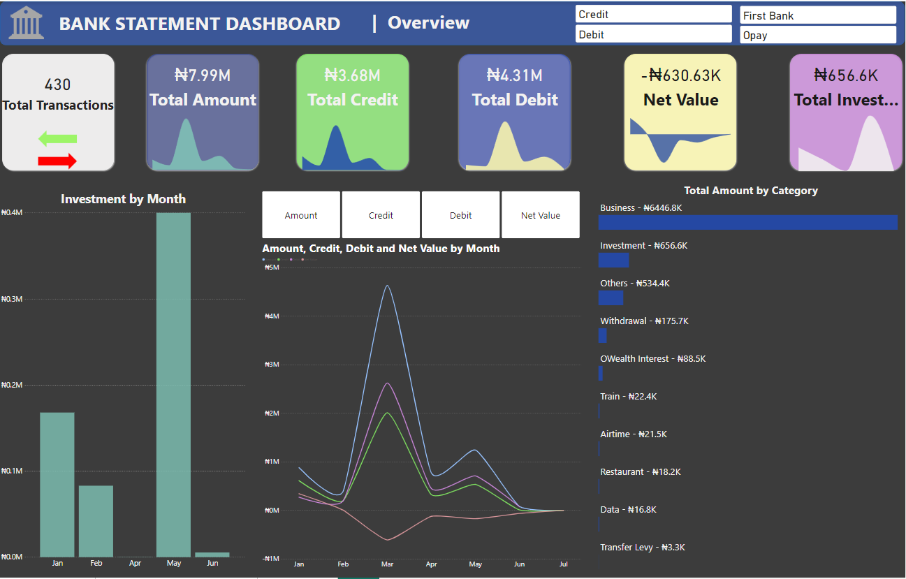
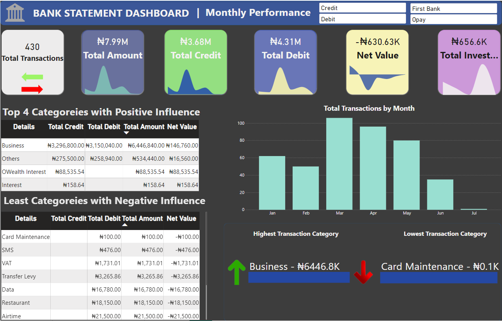

# Financial-Analysis

Analysing my Bank statements to understand my spending habits.
With the economic situations in the country, I decided to have a dive into some of my bank accounts to understand the financial activities within these accounts for the period of January to July, 2024. Here is a breakdown of the steps I took to analyse these statements.

 

 
<ol>
  <li>Data Collection: I downloaded my FirstBank statement and requested for my OPay statement.</li>
  <li>Data Wrangling: The data was converted using <code>Excel</code> and cleaning was done using <code>SQL Server</code>.</li>
  <li>Cleaning, correction of datatypes and transformation was carried out using SQL Server.</li>
  <ol>
    <li>A View was created and directly queried in Power BI.</li>
  </ol>
<li>Visualisation was performed on Power BI.</li>
</ol>
 
Here are the insights generated from the analysis.
<ol>
  <li>Key Figures: There was a total of 430 transactions, the total amount is ₦7.97 million, total credit is ₦3.68 million, total debit is ₦4.31 million and the net value is   - ₦630,000.</li>
  <li>Investment by Month: The bar chart indicates the varying amount which went into investment across different months, showing peaks and troughs in investment activities.   The month which had the highest investment was in May, with a sum of ₦400,000.</li>
  <li>The line graph with a measure selector illustrates the trends in the Amount, Credit, Debit and Net Value metrics over several months, highlighting periods of high and   low financial activity.</li>
  <li>Amount spent across different categories: The bar chart shows the distribution of expenses across categories such as Business (₦6.4million), Investments (₦657,000), and Others (₦534,000).</li>
  <li>Total Transactions by Month: The bar chart shows fluctuations in transaction volumes across different months, indicating periods of high and low financial activity.      </li>
  <ol>
    <li>Highest Transaction Category: Business - ₦6.45 million</li>
    <li>Lowest Transaction Category: Card Maintenance - ₦0.1K</li>
  </ol>
  <li>Top 4 Categories with Positive with Positive Influence:</li>
  <ol>
    <li>Wealth Management: Net Value: ₦146,760.00</li>
    <li>Investments: Net Value: ₦16,560.00</li>
    <li>OWealth Interest: Net Value: ₦88,535.54</li>
    <li>Interest: Net Value: ₦158.64</li>
  </ol>
  <li>Least Categories with Negative Influence: </li>
  <ol>
    <li>Utilities: Net Value: -₦100.00</li>
    <li>Travel: Net Value: -₦476.00</li>
    <li>VAT: Net Value: -₦1,731.01</li>
    <li>Transfer Levy: Net Value: -₦3,265.86</li>
    <li>Data: ₦16,780</li>
    <li>Restaurant: ₦18,150</li>
  </ol>
  <li>Positive Categories: Wealth Management and Investments show positive net values, indicating profitable activities.</li>
  <li>Negative Categories: Utilities, Travel, VAT, and Transfer Levy have negative net values, suggesting areas of high expenditure without corresponding income.</li>
</ol>
 

## **Recommendations**

<ol>
  <li>Budgeting: </li>
  <ol>
    <li>Create a detailed monthly budget that allocates funds to essential categories (e.g., groceries, rent) and discretionary spending.</li>
    <li>Set financial goals (e.g., emergency fund, debt repayment) and allocate funds accordingly.</li>
  </ol>
<li>Investment: Continue monitoring investments and explore diversification opportunities.</li>
<li>Utilities: Consider optimizing utility expenses (e.g., electricity, water) to reduce costs.</li>
</ol>
